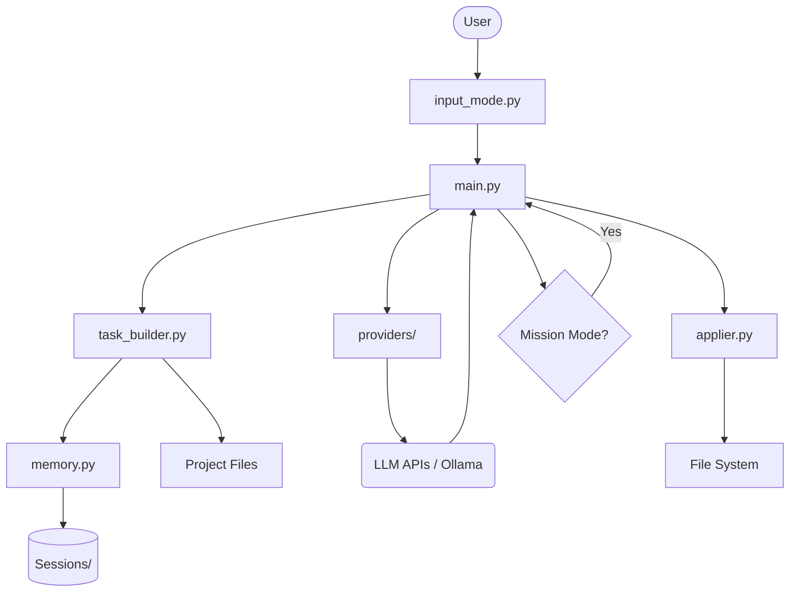

# Agent CLI

A professional, autonomous code editor (Claude-Code style) for your terminal. Build, debug, and refactor code with the power of modern LLMs, featuring advanced autonomous capabilities and rich interactive tools.

## Features

- **Enhanced Conversational Agent**: Features a professional, talkative agent providing detailed explanations and strategies.
- **Autonomous Mission Mode**: Let the agent work autonomously to complete complex multi-step tasks.
- **Multi-Provider Support**: Seamlessly switch between OpenAI, Anthropic, Gemini, DeepSeek, and local models via Ollama.
- **Intelligent Context Builder**: Attach files/folders to your prompt using the `@path` syntax.
- **Interactive Review**: Review proposed file changes and plans (syntax-highlighted diffs) before they are applied. 
- **Tool Integration**: Built-in web search, project-wide search, and web browsing capabilities.
- **Session Management**: Persistent chat sessions with snapshot and rename support.
- **Rich Terminal UI**: Beautiful markdown rendering and real-time status indicators.

## Installation

1.  **Clone the repository**.
2.  **Install dependencies**:
    ```bash
    pip install -r requirements.txt
    ```
3.  **Configure API Keys**:
    Use the `/config` command within the CLI to set your keys securely (stored in `.secrets.json`).

## Usage

Start the agent:

```bash
python src/main.py
```

### Keybindings

- **Ctrl+Enter** or **F5**: Submit your request.
- **Enter**: Add a new line in the prompt (multiline mode).
- **@filename**: Attach a file to the context.

---

## 🏛️ Project Architecture

### Design Philosophy
Agent CLI is designed as a **mission-oriented autonomous agent**. Unlike simple chat interfaces, it is architected to:
1. **Understand Project Context**: Automatically ingest file contents using `@` decorators.
2. **Think Before Acting**: Use a two-step process (Thinking + Acting) to ensure planned changes are correct.
3. **Loop Autonomously**: Support a "Mission Mode" where the agent can iterate until a goal is met.

### System Architecture



### Core Components

#### Main Entry Point (`main.py`)
- Initializes the CLI and handles slash commands.
- Implements the **Mission Logic**: A recursive loop for autonomous action.
- Manages the UI using `rich` for markdown, diffs, and tables.

#### Provider System (`providers/`)
- **`ollama.py`**: Handles local models, `<think>` tag extraction, and parameter mapping (`num_predict`).
- **Cloud Providers**: Clean wrappers for OpenAI, Anthropic, Gemini, and DeepSeek.

#### Task Construction (`task_builder.py`)
- **`@path` Expansion**: Parses input for files/dirs and injects content.
- **Context Injection**: Bundles history and mission feedback into the LLM prompt.

#### Memory & Session Management (`memory.py`)
- **Sessions**: Stored as `.json` in the `sessions/` directory.
- **Persistence**: Tracks active sessions and handles snapshotting.

#### File Operations (`applier.py`, `file_browser.py`)
- **`applier.py`**: Robust file writing with directory creation and search-replace logic.
- **`file_browser.py`**: Optimized crawler that respects `.gitignore` style patterns.

---

## Configuration

### Default Models
- **Ollama**: `qwen2.5-coder:14b` (Highly recommended for coding)
- **OpenAI**: `gpt-4o`
- **Anthropic**: `claude-3-5-sonnet-20241022`
- **Gemini**: `gemini-2.0-flash-exp`
- **DeepSeek**: `deepseek-chat`

### Ollama Setup & LAN Access
This agent is optimized for Ollama with support for advanced parameters and "Thinking" models.

#### LAN Access (Windows Setup)
If running Ollama on a different machine, use these commands on the **server**:
1. **Expose Port**:
   ```powershell
   netsh interface portproxy add v4tov4 listenport=11434 listenaddress=0.0.0.0 connectport=11434 connectaddress=127.0.0.1
   ```
2. **Allow Firewall**:
   ```powershell
   New-NetFirewallRule -DisplayName "Ollama LAN Access" -Direction Inbound -LocalPort 11434 -Protocol TCP -Action Allow
   ```
3. **Run Ollama**: Set `OLLAMA_HOST=0.0.0.0` and run `ollama serve`.

## License

This project is licensed under the MIT License - see the [LICENSE](LICENSE) file for details.
